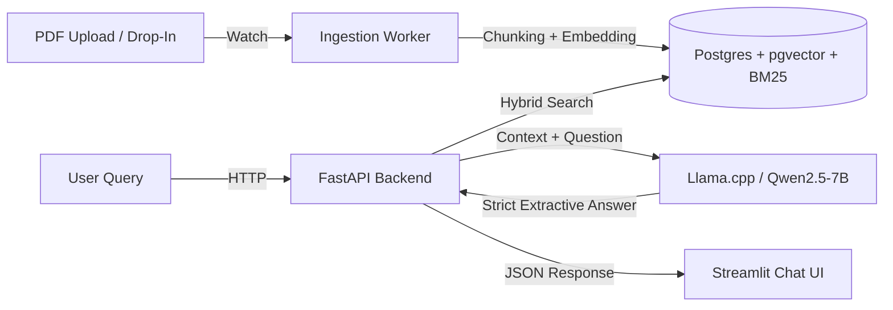

***

# RAG-based Insurance Policy Q&A System

**Status:**  Production-ready  
**Architecture:** Docker microservices  
**LLM:** Qwen2.5-7B (via llama.cpp, GPU-accelerated)

A high‑precision Retrieval‑Augmented Generation (RAG) system for answering insurance policy questions from raw PDF documents. It uses **Hybrid Retrieval** (BM25 + vector search) and a **Strict Extractive Synthesis** protocol to drive hallucinations effectively to zero.

---

##  Quick Start (Docker / Production Setup)

### Prerequisites

- Docker & Docker Compose  
- NVIDIA drivers + NVIDIA Container Toolkit (for GPU acceleration)

### 1. Clone & Setup

```bash
git clone <repo_url>
cd rag-insurance-bot
```

### 2. Launch the Stack

This single command starts:

- Llama.cpp inference server (Qwen2.5-7B)
- FastAPI backend
- Streamlit UI
- PostgreSQL (with pgvector)
- Redis
- Ingestion worker

```bash
docker-compose up -d --build
```

### 3. Access Services

- **User Interface (Streamlit):**  
  http://localhost:8501

- **Backend API Docs (FastAPI / OpenAPI):**  
  http://localhost:8000/docs

- **LLM Server (llama.cpp):**  
  http://localhost:8080

### 4. Stop the System

```bash
docker-compose down
```

***

##  System Architecture

The system is deployed as a small cluster of containers:

| Service         | Container      | Description                                  | Port |
|----------------|----------------|----------------------------------------------|------|
| Inference      | `ai_engine`    | Llama.cpp server (Qwen2.5-7B, GPU)           | 8080 |
| Backend API    | `ai_backend`   | FastAPI app (retrieval + orchestration)      | 8000 |
| Frontend       | `ai_frontend`  | Streamlit chat interface                     | 8501 |
| Database       | `rag_db`       | PostgreSQL + pgvector extension              | 5432 |
| Cache / Queue  | `redis`        | Redis for session state / lightweight queue  | 6379 |
| Ingest Worker  | `ai_ingest`    | Watches PDFs, runs chunking + embedding      | —    |

### Data Flow (High-Level)



***

##  Manual Setup (Local Dev / Debug)

Use this path only if you’re debugging individual Python scripts or developing outside Docker.

### Prerequisites

- Python 3.10+
- Local PostgreSQL
- `cmake` and build toolchain (for llama.cpp)
- (Optional) CUDA for GPU build

### 1. Environment

```bash
python -m venv .RAGBOT
source .RAGBOT/bin/activate
pip install -r requirements.txt
```

### 2. Database (Dev)

```bash
# Only DB via docker-compose (dev override)
docker-compose -f docker-compose.dev.yml up -d db
```

### 3. Services (Three Terminals)

**Tab 1 – Llama Server**

```bash
cd scripts/llama.cpp
./build/bin/llama-server \
  -m /models/Qwen2.5-7B-Instruct-Q6_K.gguf \
  -ngl 33 \
  --port 8080
```

**Tab 2 – Backend API**

```bash
uvicorn api.server:app --host 0.0.0.0 --port 8000 --reload
```

**Tab 3 – Frontend**

```bash
streamlit run ui/streamlit_app.py --server.port 8501
```

> Note: `run_full_system.py` is deprecated in favor of Docker Compose.

***

##  Key Technical Design

### Zero-Hallucination Strategy

- **Strict System Prompt**

  The LLM is instructed to:
  - Use **only** retrieved excerpts.
  - Copy answers **verbatim** from context.
  - Respond with:
    - `Answer: <text>`  
    - `Sources: [doc_id | chunk_id], [...]`
  - If the answer is not explicitly present, it must return:  
    `"Not found in provided excerpts."`

- **Post-Generation Validation**

  After the LLM responds, the backend:
  - Checks whether the predicted answer text is a substring (normalized) of at least one retrieved chunk.
  - If not, the answer is rejected and replaced with `"Not found in provided excerpts."`

- **Fallback**

  Prefer **no answer** over hallucinated answer in a regulated domain.

### Retrieval Tuning (Week 2 “Locked” Settings)

- **Hybrid Retrieval**: BM25 + vector similarity
  - `bm25_weight = 0.7` – prioritize exact term matches (e.g., “Section 4.1”, “NCB”, “IDV”).  
  - `vector_weight = 0.3` – capture semantic similarity and paraphrases.
- **Reranking**:
  - Top‑10 chunks from hybrid retrieval.
  - Optional cross‑encoder reranker narrows to **Top‑5** chunks for the LLM context window.

---

##  Project Structure

```plaintext
├── api/                  # FastAPI application (RAG orchestration, /ask endpoint)
├── config/               # System constants & config
│   └── synthesis_config.py  # Strict RAG + LLM settings (locked)
├── data/                 # Data volumes (mapped in Docker)
│   ├── chunks/           # JSONL semantic chunks
│   ├── models/           # GGUF model files (Qwen, etc.)
│   └── policies/         # Raw PDF policies
├── scripts/              # ETL, ingestion, and utilities
│   ├── auto_ingest.py    # Watchdog: new PDFs → pipeline
│   ├── pdf2md_and_semantic_chunks.py  # PDF → Markdown → semantic chunks
│   ├── embed_all_chunks.py            # Chunk embedding generator
│   ├── hybrid_retrieval.py            # Retrieval debugging / inspection
│   ├── eval_run.py       # Evaluation suite (golden dataset)
│   └── llama.cpp/        # Llama.cpp (inference engine submodule)
├── ui/                   # Streamlit chatbot frontend
├── docker-compose.yml    # Production orchestration (all services)
└── Dockerfile.*          # Individual service images
```

***

##  Testing & Evaluation

### Golden Dataset Evaluation

Run inside the backend container or local virtualenv:

```bash
python scripts/eval_run.py
```

This writes metrics such as **P@1**, **MRR**, and **hallucination rate** to:

```plaintext
eval/eval_results.json
```

### Retrieval-Only Testing

To debug or tune the retriever:

```bash
python scripts/hybrid_retrieval.py
```

This allows inspection of the top‑k retrieved chunks and their hybrid scores for sample queries.

